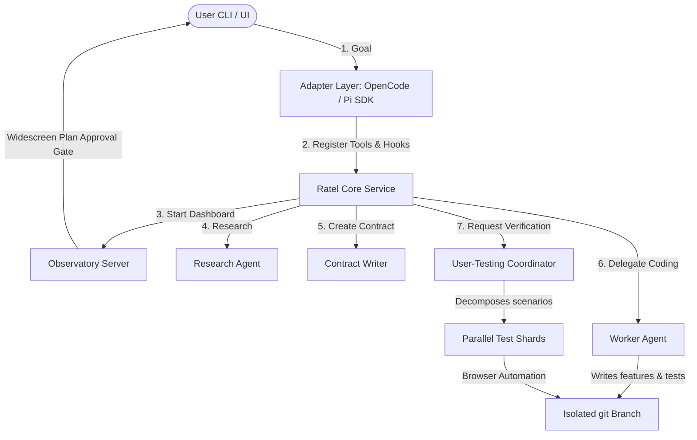

<p align="center">
  
</p>

<h1 align="center">Ratel</h1>

<p align="center">
  <strong>Thin deterministic orchestration + model-owned implementation for autonomous software missions</strong>
</p>

<p align="center">
  <a href="https://nodejs.org"></a>
  <a href="https://www.typescriptlang.org"></a>
  <a href="https://github.com/earendil-works/pi-coding-agent"></a>
</p>

<p align="center">
  ⭐ If you like this project, star it on GitHub!
</p>

<p align="center">
  <a href="#what-is-ratel">What is Ratel?</a> •
  <a href="#key-features">Key Features</a> •
  <a href="#installation--setup">Installation & Setup</a> •
  <a href="#architecture">Architecture</a> •
  <a href="#how-it-works">How It Works</a> •
  <a href="#configuration">Configuration</a> •
  <a href="#development">Development</a>
</p>

---

## What is Ratel?

Ratel is an **AI Software Factory** — a framework designed for running autonomous, end-to-end software development missions. It orchestrates specialised LLM agents to plan, implement, and validate software projects while maintaining strict, deterministic control over process scheduling, repository isolation, schema validation, persistence, and branch integration.

> [!IMPORTANT]
> **Core Philosophy:** 
> * **Deterministic Code** owns the structural framework: database schemas, local persistence, execution timeouts, agent routing, and completion logic.
> * **Model Agents** own the cognitive work: task planning, source implementation, test creation, code reviews, and product judgment.
> * **Non-Bypassable Gates** ensure that features can only be merged into the main codebase when they pass all validators with zero high-severity issues.

---

## Key Features

*   ⚙️ **Deterministic Process Control** — Rigid validation gates, timeouts, and state machines ensure agent pipelines are stable and reproducible.
*   🛰️ **Live Observatory Dashboard** — Web-based monitoring interface showing live timelines, stdout streams, active git diffs, and validation feedback.
*   📄 **Interactive Widescreen Plan Review** — Review and modify the generated validation contracts and Gherkin feature files in real-time from your browser before launching missions.
*   🛠️ **Automated Sharded Testing** — Coordinates parallel user-testing shards to run automated browser and integration scenarios in isolated environments.
*   🔄 **Automatic Validation Recovery** — Identifies and attempts automatic correction of compilation, lint, or runtime errors before submitting final reports.

---

## Installation & Setup

Ratel supports multiple coding agent integrations. You can install it using the automated script installers or set it up manually from source.

### 1. Automated Installation

Choose the installer matching your target coding agent ecosystem:

#### OpenCode

```bash
# Download and execute the OpenCode adapter installer
curl -fsSL https://ratel.dev/install-opencode.sh | bash
```

This script will automatically:
*   Download and install the core Ratel factory daemon.
*   Add the `@ratel/opencode` plugin hook configuration inside your `opencode.json`.
*   Configure command stubs (`/ratel`, `/ratel-mission`, `/ratel-observatory`) and launch the server in the background.

#### Pi SDK

```bash
# Download and execute the Pi SDK adapter installer
curl -fsSL https://ratel.dev/install-pi.sh | bash
```

Once completed, activate the extension inside your Pi session:
```bash
pi install @ratel/pi-extension
```

This will register lifecycle hooks, state restorations, and custom toolsets (such as `run_worker` and `run_validator`) inside the Pi runtime context.

### 2. Manual Source Setup (Development Mode)

If you are developing custom adapters, dashboard components, or core tools, build the codebase from source:

```bash
# Clone the repository
git clone <repository-url>
cd ratel-web

# Install package dependencies
npm install

# Build all packages
npm run build:all

# Start the factory in direct, interactive mode
npm run dev
```

**Installer flags:**
- `--dev` — Install from local workspace instead of npm
- `--port 9999` — Override the default service port (8765)
- `--help` — Show usage

**Example:**
```bash
bash install/install-opencode.sh --dev --port 9999
```

---

## Architecture

Ratel separates client-side platform hooks (Adapters) from factory scheduling and orchestration logic (Core), running either as a standalone service or in direct in-process mode.



```
User (OpenCode or Pi SDK)
  ↓
Adapter (thin wrapper — no orchestration logic)
  │   • OpenCode Plugin: /ratel commands, ratel_start_mission tool
  │   • Pi Extension: lifecycle hooks, phase management, tools
  ↓
Ratel Service (HTTP API)
  │   • Mission management
  │   • Worker spawning
  │   • Validation
  │   • Observatory
  ↓
Orchestrator (mission planning, user interaction, phase transitions)
  ├─→ Research Agent (read-only investigation)
  ├─→ Smart Friend (peer reviewer)
  ├─→ Contract Writer (Gherkin .feature files)
  ├─→ Worker Agent (implements one feature)
  │     └─→ Prepared serial git branch (integration → feat/Fx)
  ├─→ Scrutiny Validator (automated checks + code review)
  └─→ User-Testing Validator (browser-based scenario execution)
            └─→ Sharded per .feature file
```

### Adapter Architecture

Ratel uses a **service-first** architecture:

- **Core Service** (`@ratel/core`) — runs as a standalone HTTP service. All state lives here.
- **Adapters** are thin HTTP clients that register tools/commands with the agent's extension API.
- **Direct mode** — `src/adapters/pi-sdk/main.ts` runs the core in-process without the HTTP layer (for development).

**Key rule:** Adapters hold no state. All state lives in the service.

### Key Components

| Component | Responsibility |
|---|---|
| **Adapter Layer** | Client-side wrappers (`src/adapters`) that map Ratel tools and slash commands into native agent environments (OpenCode CLI, Pi Interactive TUI). |
| **Orchestrator** | Coordinates the lifecycle flow, schedules agent sessions, and manages state checkpoints. |
| **Research Agent** | Inspects the repository and codebase structure to identify dependencies and constraints in a read-only environment. |
| **Contract Writer** | Formulates the high-level `validation-contract.md` and generates individual Gherkin `.feature` specifications. |
| **Worker Agent** | Implements code changes in parallel git branches under test-driven development (TDD). |
| **Scrutiny Validator** | Automatically verifies code syntax, typings, lints, and executes code reviews on worker submissions. |
| **User-Testing Coordinator** | Schedules sharded browser runs using cucumber frameworks to verify user flows. |
| **Observatory Dashboard** | Node HTTP web dashboard (`src/observatory`) used for monitoring timelines, viewing file diffs, and reviewing Gherkin plans. |

---

## How It Works

### Mission Lifecycle Phases

1.  **Intake**: The orchestrator receives the goal specification from the user.
2.  **Discovery**: Agents inspect the directory structure and existing code libraries to ensure compatibility.
3.  **Clarification**: The system resolves ambiguous requirements through interactive CLI prompts.
4.  **Constraint Analysis**: Identifies technological boundaries, non-goals, and dependency requirements.
5.  **Validation Contract**: The contract agent drafts high-level verification criteria and details scenarios.
6.  **Feature Decomposition**: Deconstructs the contract into concrete feature directories with automated checks.
7.  **User Approval**: The user reviews the plan and feature specifications in the browser dashboard.
8.  **Execution**: Worker subagents code, write tests, and integrate features serially upon successful validations.

### Workspace Isolation

Ratel enforces rigorous Git safety gates to prevent agent-owned modifications from polluting your primary codebase:
*   The orchestrator auto-discovers or sets up a clean `integration` branch.
*   Worker agents spawn a separate feature branch (`feat/F1`, `feat/F2`, etc.) for each milestone.
*   A feature is only merged back to `integration` upon passing all security and execution checks.

### Feature Completion Gate

A feature is strictly blocked from completion unless the following requirements are met:
*   The worker submits a valid, parseable handoff report (`parseStatus: "ok"`).
*   No `leftUndone` items exist in the feature manifest.
*   Zero high-severity issues or compiler warnings are discovered by the validators.
*   Workspace finalization successfully completes a git merge.

---

## Configuration

Ratel is configured via a global `ratel.json` file in the root directory:

```json
{
  "name": "ratel",
  "version": "0.1.0",
  "observability": {
    "enabled": true,
    "port": 8765,
    "autoOpen": false
  },
  "orchestrator": {
    "model": "openai/gpt-4o",
    "thinkingLevel": "medium",
    "defaultSkills": [
      "grill-with-docs",
      "parallel-web-search"
    ]
  },
  "workers": {
    "model": "anthropic/claude-3-5-sonnet",
    "defaultTools": ["read", "bash", "edit", "write"]
  },
  "validators": {
    "model": "openai/gpt-4o",
    "defaultTools": ["read", "bash", "grep"]
  }
}
```

> [!TIP]
> Model configurations map to the Pi SDK registry. You can override active models per-session using the CLI `set_model` tool.

---

## Development

### Script Commands

```bash
# Development
npm run dev          # Start factory in direct mode (tsx)
npm run dev:core     # Start core service (tsx)

# Building
npm run build        # Build root package
npm run build:all    # Build all packages

# Testing
npm test             # Run all tests (10 tests)
npm test:all         # Test all packages

# Running
npm start            # Run compiled factory (node dist/main.js)

# Package-specific
npm run build --workspace=packages/core
npm run build --workspace=packages/opencode-plugin
npm run build --workspace=packages/pi-extension
```

### Project Structure

```
ratel/
├── packages/
│   ├── core/                     # @ratel/core — Factory service
│   │   ├── src/
│   │   │   ├── api.ts            # HTTP API server
│   │   │   ├── index.ts          # Service entry point
│   │   │   ├── core/             # Factory core logic
│   │   │   │   ├── orchestrator.ts
│   │   │   │   ├── tools.ts
│   │   │   │   ├── workers/
│   │   │   │   ├── mission/
│   │   │   │   └── ...
│   │   │   └── observatory/      # Dashboard service
│   │   └── package.json
│   │
│   ├── opencode-plugin/          # @ratel/opencode — OpenCode plugin
│   │   ├── src/
│   │   │   ├── plugin.ts         # Plugin entry
│   │   │   ├── service.ts        # HTTP client
│   │   │   ├── commands.ts       # Command handlers
│   │   │   └── prompts.ts        # Prompts
│   │   ├── commands/             # Slash command stubs
│   │   │   ├── ratel.md
│   │   │   ├── ratel-mission.md
│   │   │   └── ratel-observatory.md
│   │   └── package.json
│   │
│   └── pi-extension/             # @ratel/pi-extension — Pi extension
│       ├── src/
│       │   ├── extension.ts      # Extension entry
│       │   ├── service.ts        # HTTP client
│       │   ├── tool-scope.ts     # Phase management
│       │   ├── commands.ts       # Command handlers
│       │   └── prompts.ts        # Prompts
│       └── package.json
│
├── src/                    # Factory source code (backward compat / direct mode)
│   ├── core/              # Original core logic
│   ├── observatory/       # Original observatory
│   └── adapters/          # Pi SDK direct mode
│       └── pi-sdk/
│           ├── main.ts    # Direct/headless entry
│           └── agents.ts  # Pi-specific helpers
│
├── test/                   # Factory tests (10 tests)
├── install/               # Installer scripts
│   ├── install-opencode.sh
│   └── install-pi.sh
│
├── .pi/skills/            # Pi SDK skills
├── skills/                # Custom skills
├── ratel.json             # Factory configuration
├── tsconfig.json          # TypeScript configuration
└── package.json           # Workspace root
```

### Testing

The factory has 77 tests covering:
- Workspace resolution with explicit directories
- Feature completion gate enforcement
- Report submission and parsing
- JSONL robustness
- Mission schema normalization
- Integration preflight checks
- User-testing shard aggregation
- Validation recovery semantics

### Observatory Dashboard

When the factory starts, it launches a read-only observatory dashboard:
- URL: `http://localhost:8765` (auto-falls back if port busy)
- Shows: agent spans, tool calls, parse status, phase transitions, halt events
- Data source: `.missions/current/events.jsonl`

---

## Adapters

### OpenCode Plugin (`@ratel/opencode`)

**Commands:**
- `/ratel` — Toggle factory mode
- `/ratel-mission` — Show current mission status
- `/ratel-observatory` — Open Observatory dashboard

**Tools:**
- `ratel_start_mission` — Start a new mission with a goal
- `ratel_get_status` — Get mission status
- `ratel_run_worker` — Run a worker for a feature
- `ratel_run_validation` — Run validation for a milestone

### Pi Extension (`@ratel/pi-extension`)

**Commands:**
- `/ratel` — Toggle factory mode
- `/ratel-mission` — Show current mission status
- `/ratel-observatory` — Open Observatory dashboard

**Tools:**
- `ratel_start_mission` — Start a new mission
- `ratel_run_worker` — Run a worker for a feature
- `ratel_run_validator` — Run validation for a milestone

**Lifecycle hooks:**
- `session_start` — Restore persisted phase state
- `before_agent_start` — Inject factory context
- `turn_end` — Track phase transitions based on tool usage
- `tool_call` — Gate writes during planning phase

### Service API

```bash
GET  /health                    → { status: "ok" }
POST /api/mission/start         → { goal: string } → { missionId }
GET  /api/mission/status        → { missionId } → { state }
POST /api/mission/worker        → { missionId, featureId } → { status }
POST /api/mission/validate      → { missionId, milestoneId } → { status }
GET  /api/mission/artifacts     → { missionId } → { artifacts }
POST /api/mission/complete      → { missionId, featureId } → { status }
GET  /api/observatory/events    → { events }
GET  /api/observatory/status    → { enabled, url }
```

---

## Philosophy & Constraints

**What the factory controls (deterministic):**
- Branch detection, workspace finalization
- Parse/report schema validation
- Timeouts, raw output persistence
- Shard IDs, concurrency limits
- Artifact paths, aggregate bookkeeping

**What models control (judgment):**
- Planning, implementation decisions
- Pass/fail judgment on validation
- Product issue severity and rationale
- Scope interpretation

**Anti-patterns the factory avoids:**
- Hard-coded scenario severity rules
- Deterministic product behavior rules
- Replacing validators with deterministic BDD runners
- Heavy deterministic state machines
